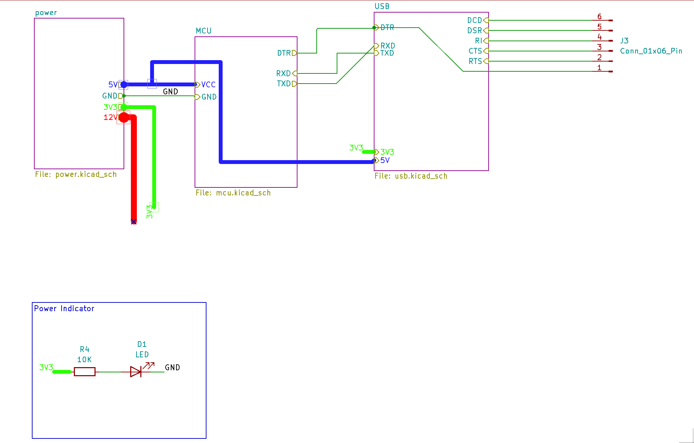
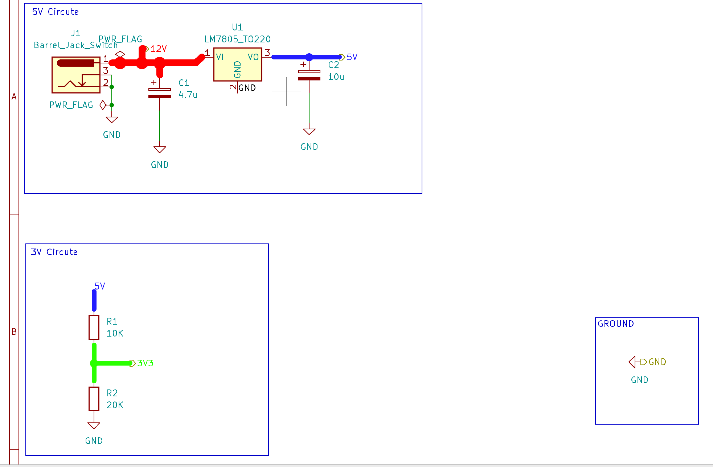
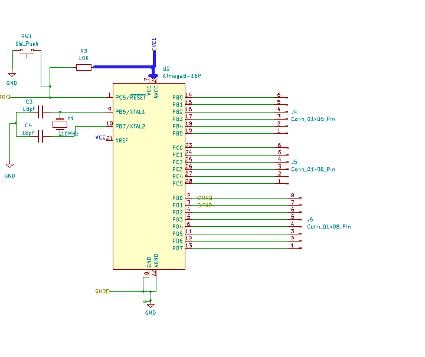
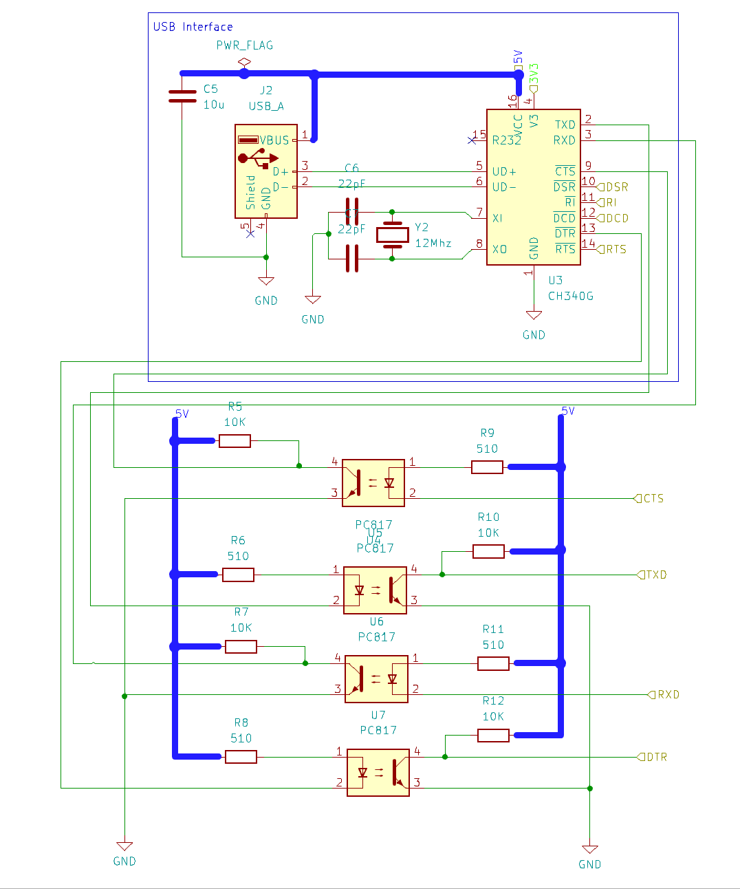

# ATMEGA328P Microcontroller USB Programmer

This project is a simple USB programmer for the ATMEGA328P microcontroller. It allows you to program the microcontroller
using a USB connection.

## Features

- USB interface for programming
- Supports ATMEGA328P microcontroller
- Easy to use

## Requirements

- ATMEGA328P microcontroller
- USB cable
- Computer with USB port

## Screenshots

## License
